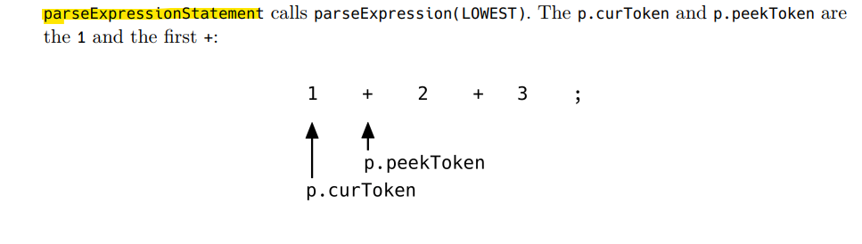

# Interpreter from scratch

I truly wanted to understand how interpreters work and that included understanding how `lexers` and `parsers` work.

## What is an interpreter?
Interpreter: take source code and evaluate it.

> Interpreters that parse the source code, build an *abstract syntax tree (AST)* out of it and then evaluate this tree. This type of interpreter is sometimes called “tree-walking” interpreter, because it “walks” the AST and interprets it.

## What we want?
> We build a tree-walking interpreter.

We're going to build our own **lexer**, our own **parser**, our own tree representation and our own evaluator. We'll see what **tokens** are, what an `abstract syntax tree` is, `how to build such a tree`, `how to evaluate it` and how to extend our language with new data structures and built-in functions.

> Parsing is one of the most well-understood branches of `computer science` and really smart people have already invested a lot of time into the problems of parsing. The results of their work are CFG, `BNF`, `EBNF`, `parser generators` and advanced parsing techniques used in them. Why shouldn't you take advantage of that?

### Writing your own parser is not a waste of time rather immensely valuable.
We are here to learn, we want to understand `how parsers work`. And it's my opinion that `the best way to do that is by getting our hands dirty` and `writing a parser ourselves`. Also, I think it's immense fun.

## Why it is important?
Without a [compiler](https://github.com/mateors/compiler) or an `interpreter` a programming language is nothing more than an idea or a specification.

## Terminology

### A special type of functions | Higher order functions
> Higher order functions: These are functions that take other functions as arguments.

### First class functions
> A function act like a values, like integars or strings.

### REPL |  Read–Eval–Print Loop
> REPL: A read–eval–print loop (REPL), also termed an interactive toplevel or language shell, is a simple interactive computer programming environment that takes single user inputs, executes them, and returns the result to the user; a program written in a REPL environment is executed piecewise.

### Lexing
> To work with source code we need to turn it into a more accessible form.

> We're going to write our own lexer. It will take source code as input and output the tokens that represent the source code. It will go through its input and output the next token it recognizes.

### AST
> Internal representation of the code called abstract syntax tree (AST)

> Data structure used for the internal representation of the source code

### WHAT IS PARSER?
> A parser is a software component that takes input data (frequently text) and builds a data structure – often some kind of parse tree, abstract syntax tree or other hierarchical structure – giving a structural representation of the input, checking for correct syntax in the process

* Takes input
* Builds data structure ( Parse tree | Abstract syntax tree | Hirerchical structure)
* Checking for correct syntax.

```In one words Parser is Structural representation of its input.```

> A parser turns its input into a data structure that represents the input.


## Goal of our project
The focus of this book is the `interpreter we are writing` - the ideas and concepts behind it and its implementation

> It will `tokenize` and `parse` our `source code` in a REPL, building up an `internal representation of the code` called `abstract syntax tree` and then `evaluate` this tree. 

It will have a few major parts:
* the lexer
* the parser
* the Abstract Syntax Tree (AST)
* the internal object system
* the evaluator

```source_code -> Tokens -> Abstract Syntax Tree / AST```

### The First transformation:
> From source code to tokens, is called `"lexical analysis"` or lexing for short. Its called `lexer` (also called tokenizer or scanner)

### The Second transformation:
> Turns the tokens into an `"Abstract Syntax Tree"`

## Strategies
There are two main strategies when parsing a programming language: top-down parsing or bottom-up parsing.

Top-down parsing:
1. Recursive descent parsing
2. Early parsing
3. Predictive parsing

> The parser we are going to write is a recursive descent parser.

And in particular, it's a `top down operator precedence` parser, sometimes called "`Pratt parser`", after its `inventor Vaughan Pratt`.

## Pratt Parsing
* [Simple-but-powerful-pratt-parsing](https://matklad.github.io/2020/04/13/simple-but-powerful-pratt-parsing.html)
* [Parsing-made-easy](https://journal.stuffwithstuff.com/2011/03/19/pratt-parsers-expression-parsing-made-easy)
* [Recursive-descent-and-pratt-parsing](https://chidiwilliams.com/post/on-recursive-descent-and-pratt-parsing)
* [Handwritten a Parser](https://segmentfault.com/a/1190000041457544/en)

*"Pratt Parsing is very simple to understand, trivial to implement, easy to use, extremely effcient in practice if not in theory, yet flexible enough to meet most reasonable syntactic needs of users"*

Top Down Operator Precedence Parsing, or Pratt parsing, was invented as `an alternative to parsers` based on context-free grammars and the Backus-Naur-Form.

And that is also the `main difference`: instead of associating parsing functions with `grammar rules (defined in BNF or EBNF)`, Pratt associates these functions (which he calls `"semantic code"`) with single token types.

A crucial part of this idea is that each token type can have two parsing functions associated with it, depending on the token's position - `infix` or `prefix`.

* The first thing we need to do for expression parsing is to prepare our AST.

> Let statement -> `let x = 5 + 5;`

> Expression statement -> `x + 5;`


## Implementing the Pratt Parser
A Pratt parser’s main idea is the association of parsing functions *(which Pratt calls "semantic code")* with token types.

Each token type can have up to two parsing functions associated with it, depending on whether the token is found in a prefix or an infix position.


## Statement
> a statement is a single line of code that performs a specific task. 

## Let statement structure
> Let statement - of the following form:
```let <identifier> = <expression>;```

```
lex x = 5; //let statement

     <let>
LEFT <->  RIGHT
x	  5
``` 

### The difference between `statements` and `expressions` 
> `Expressions produce values, statements don't`


## Parsing Expressions
Parsing expressions is the most interesting part of writing a parser. As we just saw, parsing statements is relatively straightforward. We process tokens from `left to right`, expect or reject the next tokens and if everything fits we return an `AST node`.

Parsing expressions, on the other hand, contains a few more challenges. `Operator precedence` is probably the first one that comes to mind and is best illustrated with an example.

 ### Prefix operators
 > A prefix operator is an operator "in front of" its operand.
 * -5
 * !true
 * !false

### Postfix operators
 A postfix operator is an operator "after" its operand

 ### Infix operators (or "binary operators")
 > An infix operator sits between its operands
 * 5 + 5
 * 5 - 5
 * 5 / 5
 * 5 * 5

### We can use parentheses to group expressions and influence the order of evaluation
* 5 * (5 + 5)
* ((5 + 5) * 5) * 5

### There are call expressions:
* add(2, 3)
* add(add(2, 3), add(5, 10))
* max(5, add(5, (5 * 5)))

### Identifiers are expressions too:
* foo * bar / foobar
* add(foo, bar)

## IF expressions
* `let result = if (10 > 5) { true } else { false };`
* `result // => true`

## Prefix operator syntax
> `<prefix operator><expression>;`
*unary expressions*

## Infix operator syntax
> `<expression> <infix operator> <expression>;`
*Because of the two operands (left and right) these expressions are sometimes called "binary expressions"*


## Table-driven testing approach
* [Deep-dive-into-table-driven-testing](https://engineering.mercari.com/en/blog/entry/20211221-a-deep-dive-into-table-driven-testing-in-golang)
* [gotests makes writing Go tests easy](https://github.com/cweill/gotests)

### Here is what happens when we parse `1 + 2 + 3;`




### When parsing the expression statement `-1 * 2 + 3`

```
BEGIN parseExpressionStatement
        BEGIN parseExpression
                BEGIN parsePrefixExpression
                        BEGIN parseExpression
                                BEGIN parseIntegerLiteral
                                END parseIntegerLiteral
                        END parseExpression
                END parsePrefixExpression
                BEGIN parseInfixExpression
                        BEGIN parseExpression
                                BEGIN parseIntegerLiteral
                                END parseIntegerLiteral
                        END parseExpression
                END parseInfixExpression
                BEGIN parseInfixExpression
                        BEGIN parseExpression
                                BEGIN parseIntegerLiteral
                                END parseIntegerLiteral
                        END parseExpression
                END parseInfixExpression
        END parseExpression
END parseExpressionStatement
```

## Block statements 
Block statements are a series of statements enclosed by an opening `{` and a closing `}`

## IF-ELSE conditional statement structure
> `if (<condition>) <consequence> else <alternative>`

> *parsing is prone to off-by-one errors*

## Structure of function literals

### Function literals look like this:
```
fn(x, y) {
return x + y;
}
```

It starts with the keyword fn, followed by a list of parameters, followed by a block statement, which is the function’s body, that gets executed when the function is called. The abstract structure of a function literal is this:

> `fn <parameters> <block statement>`

### The parameters in function
They are just a list of identifiers that are comma-separated and surrounded by parentheses:

> `(<parameter one>, <parameter two>, <parameter three>, ...)`

This list can also be empty:
```
fn() {
return foobar + barfoo;
}
```

### The two main parts of a function literals
1. The list of parameters 
2. The block statement that is the function's body. 

That's all we need to keep in mind when defining the AST node:

## Call Expressions structure
> `<expression>( <comma separated expressions> )`

## Evaluation
A treewalking interpreter that recursively evaluates an AST is probably the slowest of all approaches, but easy to build, extend, reason about and as portable as the language it’s implemented in.

An interpreter that compiles to bytecode and uses a virtual machine to evaluate said bytecode is going to be a lot faster. But more complicated and harder to build, too. [Checkout our compiler](https://github.com/mateors/compiler)

## A Tree-Walking Interpreter
> Executing the AST while traversing it. 

We are going to build is a `tree-walking interpreter`. We are going to `take the AST` our parser builds for us `and interpret it` `"on the fly"`, without any preprocessing or compilation step.

The design we are going to use is heavily inspired by the interpreter presented in `The Structure and Interpretation of Computer Programs` (SICP), especially its usage of environments.

> Becase it's the easiest way to get started, it's easy to understand and to extend later on.

### We only need two things really: 
1. A tree-walking evaluator 
2. A way to represent values in Golang (host language).

* If you want to build a fast interpreter you can't get away with a slow and bloated object system.
* And if you are going to write your own garbage collector, you need to think about how it will keep track of the values in the system.
* If you don’t care about performance, then it does make sense to keep things simple and easy to understand until further requirements arise.


## Structure of Eval (first version)
> `func Eval(node ast.Node) object.Object`

Eval will take an `ast.Node` as input and return an `object.Object`.

## Environment
> the environment is a hash map that associates strings with objects.

## Functions
1. Define an internal representation of functions in our object system 
2. Add support for function calls to Eval.

> Extending the environment

Closures are functions that “close over” the environment they were defined in. They carry their own environment around and whenever they’re called they can access it.

## Higher-order functions
Higher-order functions are functions that either return other functions or receive them as arguments.

## Garbage collection (GC)
In short: keep track of object allocations and references to objects, make enough memory available for future object allocations and give memory back when it’s not needed anymore. This last point is what garbage collection is all about. Without it the programs would “leak” and finally run out of memory

### mark and sweep algorithm.
> allocating and freeing memory

### system calls
> Talking to the kernel is normally done via something called system calls.

### Array
> Elements in an array literal can be any type of expression. Integer literals, function literals, infix or prefix expressions.

### Index operator expressions
* myArray[0];
* [1, 2, 3, 4][2]; //array literal
* let myArray = [1, 2, 3, 4]; myArray[2]; //an identifier
* myArray[2 + 1];
* returnsArray()[1]; //function cal

### Basic Structure of Array expression
> `<expression>[<expression>]`

### Array Index 
It can be any expression. Syntactically it doesn’t make a difference which one it is, but semantically it has to produce an integer.

## Parsing Hash Literals

### Basic syntactic structure of a hash literal:
> `{<expression> : <expression>, <expression> : <expression>, ... }`

## Testing our lexer
* `go test ./lexer/`
* `go test ./ast/`
* `go test ./parser/`
* `go test -run TestOperatorPrecedenceParsing ./parser/`
* `go test -v -run TestOperatorPrecedenceParsing2 ./parser/`


## Supportd features of our interpreter.
* integers
* booleans
* strings
* arrays
* hashes
* prefix-, infix- and index operators
* conditionals
* global and local bindings
* first-class functions
* return statements
* closures

## Books Need to Study
* http://www.duntemann.com/assembly.html
* http://peter.michaux.ca/articles/scheme-from-scratch-introduction
* https://lisperator.net/pltut/